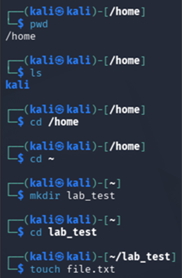
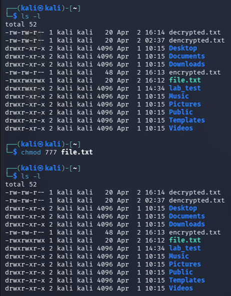
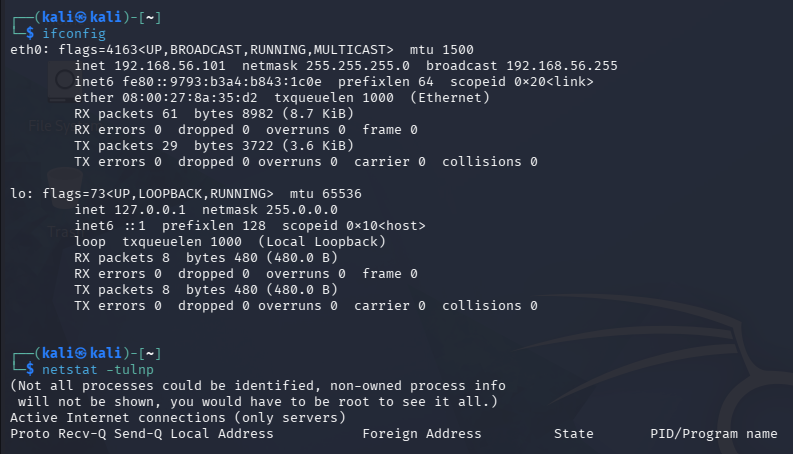
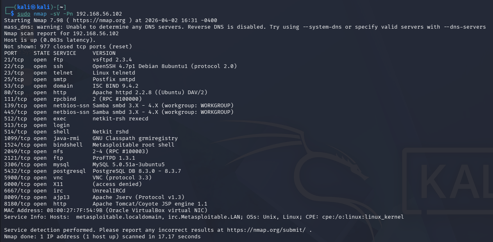
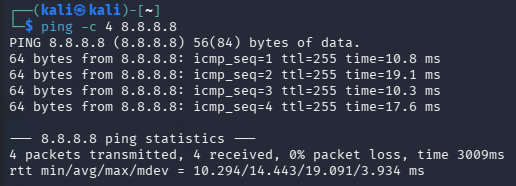
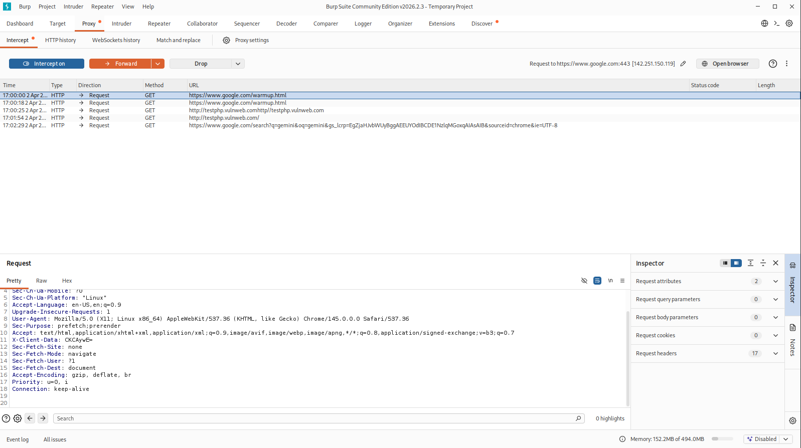
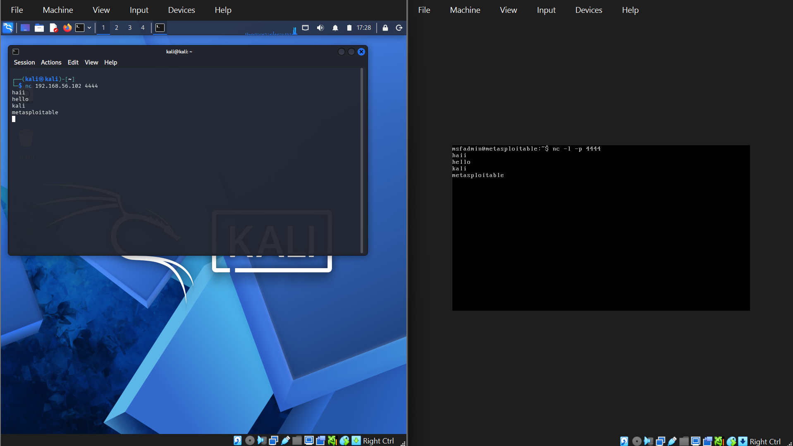

# 🔐 Cybersecurity Lab Project

## 📌 Objective
To build strong fundamentals in cybersecurity, networking, cryptography, and perform hands-on testing using industry tools.

---

## 🛠️ Tools Used
- Kali Linux  
- Metasploitable2  
- Wireshark  
- Nmap  
- Burp Suite  
- Netcat  

---

## 🧠 Concepts Covered
- CIA Triad  
- Types of Cyber Attacks  
- OSI Model  
- TCP/IP Protocol  
- DNS, HTTP/HTTPS  
- IP Addressing, Subnetting, NAT  
- Cryptography Basics  

---

## ⚙️ Practical Work

### 🐧 Linux Commands
Performed file navigation, permissions, and package management.

---

### 🌐 Networking
Tested connectivity and analyzed network configuration.

---

### 🔐 Cryptography
Encrypted and decrypted files using OpenSSL.

---

### 🔎 Nmap Scan
Scanned target machine to identify open ports and services.

---

### 📡 Wireshark
Captured and analyzed ICMP packets.

---

### 🌐 Burp Suite
Intercepted HTTP requests using proxy.

---

### 🔗 Netcat
Established connection between machines.

---

## 📁 Project Structure
